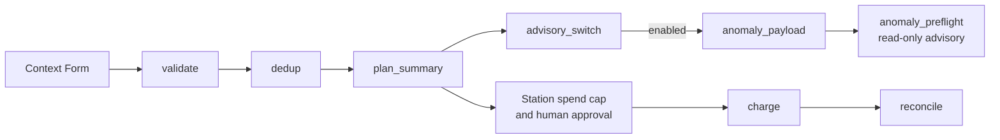

# Retainer Billing Run

`dave/retainer-billing-run` is a governance-first monthly retainer billing workflow for RailCall Station v0.55. It validates a batch, removes duplicate and already-billed clients, summarizes planned spend, optionally requests anonymized AI advice, presents charge effects for human approval, and reconciles intended versus landed results.

Workflow version: `1.4.0`. The source `updated` field is `2026-08-05T00:00:00Z`.

Demo video: https://youtu.be/RpGMJgPzEcw

## Workflow diagram



## Legacy canvas and engine DAG

The file retains two compatible representations:

### Legacy canvas rail

The top-level canvas contains five nodes and four edges:

1. `validate`
2. `dedup`
3. `plan_summary`
4. `charge`
5. `reconcile`

This preserves compatibility with the older canvas workflow loader.

### Station v0.55 `engine_spec`

The modern DAG contains eight nodes across three branches:

| Node | Type | Branch | Purpose |
|---|---|---|---|
| `validate` | transform | prepare | Reject malformed rows, missing email, and non-positive or non-integer amounts. |
| `dedup` | transform | prepare | Remove duplicate exports and emails already billed in the current period. |
| `plan_summary` | transform | prepare | Count billable, skipped, and rejected rows and total planned cents. |
| `advisory_switch` | transform | advisory | Parse the opt-in `enable_anomaly_advisory` context value. |
| `anomaly_payload` | transform | advisory | Build an anonymized portfolio with opaque `batch-N` references. |
| `anomaly_preflight` | effect | advisory | Call the read-only billing anomaly decision-support command. |
| `charge` | effect | billing | Fan out clean rows to the approval-controlled billing command. |
| `reconcile` | transform | billing | Compare intended and landed effects and report the difference. |

The `charge` and advisory branches both descend from `plan_summary`. The advisory branch is not a parent, condition, or gate for `charge`.

## Data flow

### Validate

`validate` reads `ctx.clients`. A valid row requires a non-empty email and a positive integer `amount_cents`. Booleans, floats, zero, negative values, malformed rows, and missing identities are rejected with a reason.

### Dedup and `already_billed`

`dedup` consistently uses email for both protections:

- A repeated email in the same export is skipped as `duplicate_in_export`.
- An email in `ctx.already_billed` is skipped as `already_billed_this_period`.

The clean output contains `email`, `amount_cents`, `description`, and `period`. `description` is generated deterministically as `Retainer billing for <billing_period>` (with the non-empty fallback `Retainer billing`), so it contains no added PII and does not depend on AI. There is no customer-ID-versus-email comparison mismatch.

### Plan Summary

`plan_summary` reports:

- `billable_count`
- `skipped_count`
- `rejected_count`
- `total_cents`
- `spend_ceiling_cents`
- `within_cap`
- `proceed`

The summary is deterministic and useful for operator review. The platform-enforced financial ceiling is `engine_spec.capabilities.max_spend_cents`; the summary's `proceed` field is not wired as a charge condition.

### Optional AI Advisory

Set `enable_anomaly_advisory` to `true` to enable the advisory branch. It uses action ID `groq_billing_billing_anomaly_detect`, which resolves to the module's `stripe.billing.billing_anomaly_detect` read command.

The advisory is:

- Read-only and `decision_support_only`.
- Optional and disabled by default.
- Built from anonymized aggregate metrics.
- Never a gate for charge.
- Never permitted to approve, deny, or alter a financial effect.

The payload contains the billing period, aggregate amount fields, counts, optional baseline values, and opaque `batch-N` references. It excludes email, customer name, Stripe customer ID, and invoice ID.

### Charge

`charge` uses:

```text
action_id: stripe_billing_bill_client
provider: stripe
for_each: {{nodes.dedup.clean}}
args: {{ctx.item}}
retry: max 3, backoff 2 seconds
```

The action resolves to `stripe.billing.bill_client` from `dave/stripe-invoicing`. It remains `write_requires_approval`, idempotent, and receipt-required at the module boundary. No path bypasses Station governance to call Stripe directly.

Each clean row supplies the module's required `email`, `amount_cents`, and non-empty `description` fields. A provider-independent regression invoked the real `stripe.billing.bill_client` handler with fixture transport and confirmed the deterministic description reaches invoice and line-item preparation before any provider boundary.

### Reconcile

`reconcile` compares `plan_summary.billable_count` with landed charge outputs containing an invoice or effect ID. It returns `intended`, `landed`, `difference`, and `total_planned_cents`. Reconciliation reports evidence; it does not invent provider success.

## Station v0.55 integration

### DAG Runner and planner

`engine_spec` makes the workflow available to the Station DAG runner and planner. Node parents, branches, conditions, bindings, providers, retry policy, irreversible effects, and capabilities are declared in the workflow source.

### Studio Run Button and Context Form

Studio Workflows renders the workflow with a Run Button and a Context Form generated from `engine_spec.context`. Operators can review or provide:

- `clients`
- `already_billed`
- `billing_period`
- `spend_ceiling_cents`
- `portfolio_baseline_cents`
- `enable_anomaly_advisory`

The native maximum spend is declared separately in `engine_spec.capabilities.max_spend_cents`.

### MCP DAG compatibility

The workflow is discoverable through `railcall_workflows_dag_list` and can be inspected without execution through `railcall_workflow_dag_plan`. Planning exposes the DAG and financial blast radius but does not call Stripe or Groq.

## Governance

The `engine_spec` capabilities are:

```json
{
  "providers": ["stripe", "groq"],
  "max_spend_cents": 50000,
  "allow_irreversible": true
}
```

- **Approval:** `stripe_billing_bill_client` remains a human-approved external effect.
- **Spend cap:** Station enforces `max_spend_cents` before provider execution and across the charge fan-out.
- **Rollback:** a cap violation produces a rolled-back workflow outcome before the blocked effect reaches Stripe.
- **Idempotency:** the module derives Stripe idempotency keys from approved payload hashes.
- **Reconcile:** intended and landed results remain explicit even when execution is incomplete.
- **Receipts:** workflow and command receipts are Station-governed; this document does not claim a provider receipt for the currently blocked live path.

`allow_irreversible: true` declares that the workflow contains an irreversible-capable billing effect; it does not remove approval or spend-cap enforcement.

## Install

```sh
railcall market install dave/retainer-billing-run
railcall market install dave/stripe-invoicing
```

Replace the anonymous example context before a real billing run. Keep `already_billed` in the same email format used by client rows.

## Known limitation

### Station v0.55 sandbox DNS

Live provider execution is currently limited by a RailCall Station v0.55 sandbox DNS bug. An allowed Stripe or Groq hostname resolves to an IP address, then the runtime rejects that resolved IP because the allowlist contains the hostname.

The workflow is compatible with the Station v0.55 DAG runner, Studio Run Button, Context Form, MCP DAG list, and MCP DAG plan. Transform logic, charge input preparation, planning, governance, approval boundaries, spend-cap behavior, and anonymized advisory payloads have provider-independent evidence. Live Stripe, live Groq, and provider-receipt completion cannot be claimed until the official Station sandbox issue is resolved.

## Testing

See [TESTING.md](TESTING.md) for the Step 4 evidence and the separation between verified behavior, fixture-only results, and provider execution blocked by Station.

## License

MIT
