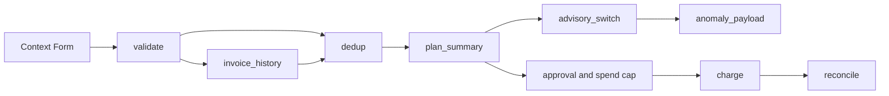

# Retainer Billing Run

`dave/retainer-billing-run` v1.6.0 is a governance-first recurring-retainer billing workflow for RailCall Station v0.66. It turns messy client input into a controlled billing plan without allowing duplicate data, incomplete history, retries, or optional AI advice to become uncontrolled financial effects.

Demo video: https://youtu.be/He6ZvGOjjt8

Module dependency: `dave/stripe-invoicing >= 1.3.0`.

## Workflow topology

The source retains a five-node legacy canvas for compatibility and defines the final eight-node `engine_spec` DAG:



| Node | Type | Purpose |
|---|---|---|
| `validate` | transform | Reject malformed rows and unsafe amount values. |
| `invoice_history` | effect | Read provider invoice history through incremental `stripe_billing_invoice_list`. |
| `dedup` | transform | Remove input duplicates, operator-declared billed rows, and matching provider-history invoices. |
| `plan_summary` | transform | Summarize billable, skipped, rejected, and planned spend. |
| `advisory_switch` | transform | Keep optional anomaly advice explicit and isolated. |
| `anomaly_payload` | transform | Build minimized advisory input without placing AI in the billing critical path. |
| `charge` | effect | Fan out approved billing through `stripe_billing_bill_client`. |
| `reconcile` | transform | Compare intended billing with provider evidence. |

`invoice_history` is the only new node from the migration. `dedup` and `plan_summary` were updated; no parallel workflow was created.

## Validation and deterministic billing

`validate` reads `ctx.clients`. A valid row requires a non-empty email and positive whole-integer `amount_cents`. Booleans, floats, zero, negative values, malformed rows, and missing identities are rejected before an effect is prepared.

Every clean row receives the deterministic description:

```text
Retainer billing for <billing_period>
```

This exact value is used for provider-history matching and passed unchanged to the approval-controlled billing command.

## History-aware deduplication

The workflow uses the existing incremental module action:

```text
invoice_history.action_id = stripe_billing_invoice_list
dedup.input_from.invoice_history = {{nodes.invoice_history._}}
```

Station v0.66 owns incremental state and watermark settlement. Deduplication covers:

- repeated email in the same input;
- email present in `already_billed`;
- provider invoice with the same client, period, amount, status, and deterministic retainer description.

A relevant provider match is labeled `stripe_history_same_period` and cannot reach `charge`. An unrelated one-off invoice does not suppress a valid candidate. Truncated history fails closed, and history-source failure stops the flow before charge.

## Scheduling and state

The workflow is compatible with a 15-minute schedule using concurrency `skip`.

- Successful scheduled execution may advance the Station-owned watermark.
- Failed, truncated, and manual runs do not advance schedule-owned state.
- Overlap is skipped instead of running concurrently.
- Missed ticks do not burst-replay.
- Execution remains subject to live policy and approval boundaries.

## Advisory isolation

The anomaly advisory is optional, minimized, and read-only. It does not receive customer email or Stripe identifiers and is not a parent, condition, approval source, or financial gate for `charge`. Missing credentials or advisory failure cannot authorize, deny, or mutate billing.

Live Groq completion has not been demonstrated and is not claimed by this documentation or the demo video.

## Charge, approval, and spend cap

`charge` fans out `nodes.dedup.clean` through `stripe_billing_bill_client` from `dave/stripe-invoicing` v1.3.0. The module action remains `write_requires_approval`, idempotent, and receipt-required. No node bypasses Station governance to call Stripe directly.

Station pins the reviewed plan and applies the native spend ceiling before provider execution. A changed plan requires a new approval. `SpendCapExceeded` stops before charge; idempotency protects safe retries but is not automatic rollback.

## Reconcile

`reconcile` compares intended billing with landed provider evidence and returns `intended`, `landed`, `difference`, and the planned total. Missing invoice evidence is reported as a difference rather than invented as success.

## Install

```sh
railcall market install dave/stripe-invoicing
railcall market install dave/retainer-billing-run
```

Review the generated Context Form, plan, spend ceiling, schedule policy, and approval payload before any real billing execution.

## Known limitations

- Live Groq completion is unverified.
- Provider success is claimed only when supported by an actual receipt or effect.
- Scheduling and watermark state belong to Station, not to workflow-local storage.
- The five-node legacy canvas is retained for compatibility; the authoritative runtime flow is the eight-node `engine_spec`.

## Testing

See [TESTING.md](TESTING.md) for the final Station v0.66 regression and runtime evidence.

## License

MIT
